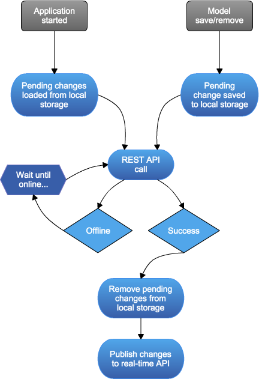

#  Rekord

Rekord is an ORM - a way to define properties and relationships - that interacts with local storage, a RESTful service, and a real-time service.
Rekord does this in a generic way so **you can use any libraries you wish** or your own implementation - making it very easy to integrate into your existing projects.
Rekord's design allows for offline capable and real-time applications if desired - offering complete control over how and where your data is stored.
Rekord is the most powerful client-side Model/Active Record/ORM you'll find guaranteed - or your money back!

**Download Stats**
- [NPM](http://npmcharts.com/compare/rekord,rekord-angular,rekord-validation,rekord-vue,rekord-storkjs,rekord-session,rekord-react,rekord-firebase,rekord-debug,rekord-pouchdb,rekord-ajax,rekord-jquery,rekord-pubsub,rekord-knex)

**Features**
- Relationships `hasOne`, `belongsTo`, `hasMany`, `hasManyThrough`, `hasRemote`, `hasList`, & `hasReference`
- Polymorphic relationships for `hasOne`, `belongsTo` & `hasMany`
- Validation (59 rules, 6 expressions, 14 transforms, and custom functions) through [rekord-validation](https://github.com/Rekord/rekord-validation)
- Migrations through [rekord-migrations](https://github.com/Rekord/rekord-migrations)
- "Sessions" through [rekord-session](https://github.com/Rekord/rekord-session)
- Batch REST execution for any/all types and operations
- Inheritance (with `extend` option)
- Horizontal scaling with `shard`ing
- Supports composite keys
- Purging algorithms and "Contexts" to control memory/local storage usage
- Specify default values
- Handle collisions with a "revision" field
- Handle propagating primary key changes returned by the server
- Automatically refresh when application becomes online
- Cache no data, all data, or only pending changes
- Send only changed values to REST/real-time APIs or entire object
- Convert values between client & server data types
- Easily order by field, combination of fields, custom function, or expression
- Use "Projections" to define subsets of data for efficient use
- Control what information from relationships (if any) is stored locally or sent to the REST api
- Add dynamic fields to model objects (setting & getting)
- Data returned from REST calls or real-time events is intelligibly merged to avoid overwriting local unsaved changes
- Add `updated_at` and `created_at` timestamps and their automatic behavior with a single option
- Configurable date/timestamp transformations
- Add custom methods to the model objects
- Asynchronous methods return Promises which can be chained together
- Load bootstrapped data with `model.boot( model or array of models )`
- Execute searches (fields are sent to REST API and an array of models is expected) with `model.search( query, options, ... )`
- Execute paginated searches
- Add global event listeners to the "database" or all model instances
- Stores data locally through `Rekord.store` interface (ex: [storkjs](https://github.com/Rekord/rekord-storkjs))
- Stores data remotely through `Rekord.rest` interface (ex: [angular](https://github.com/Rekord/rekord-angular), [jquery](https://github.com/Rekord/rekord-jquery), [ajax](https://github.com/Rekord/rekord-ajax), [pouchdb](https://github.com/Rekord/rekord-pouchdb), [firebase](https://github.com/Rekord/rekord-firebase), [knexjs](https://github.com/Rekord/rekord-knex))
- Real-time changes through `Rekord.live` interface (ex: [pubsub](https://github.com/Rekord/rekord-pubsub), [pouchdb](https://github.com/Rekord/rekord-pouchdb), [firebase](https://github.com/Rekord/rekord-firebase))
- Create a live filtered view of any collection
- Create a live paginated view of any collection
- All collections have the following notable operations: sort, page, filtered, where, subtract, intersect, complement, clear, removeWhere, min, max, first, last, sum, avg, count, pluck, reduce, random, chunk, reverse, & group
- Model collections have the following notable operations: removeWhere, update, updateWhere, & saveWhere

**FAQ (client-side usage)**

1. *Does Rekord directly interact with a database?*  
No, of course not. It interacts with a REST API.

2. *Why do I need to use Rekord?*  
Working with relational data in javascript can be painful. Rekord eases that pain by allowing you to use plain looking objects that can have any type of relationship with other objects. Rekord takes into consideration things like foreign keys - where you need object A successfully remotely saved before you can save object B. These types of constraints are ugly and bothersome to handle yourself and easily result in bugs. If you're familiar with server-side ORMs, then Rekord should be really easy to pick up. You'll find all the same features and even more!

3. *How are ID collisions avoided?*  
The key for a model can be given when creating a model - otherwise the key will be given a UUID. This is necessary to be offline capable, models need keys so related models can reference it. If the `keyChanges` option is used the server can return a different key (like an auto-incrementing value) and the key changes will be propagated to all references to that model (foreign keys).

4. *What do you mean by capable?*  
Caching data/changes locally and real-time behavior is optional - if you don't want either feature then you don't need to include an implementation.

5. *Rekord can handle horizontal scaling via sharding?*  
Yes! You can say models of type X can exist on REST endpoints A, B, & C. You can provide a function which takes a model and returns the set of REST endpoints that need to be sent saves/removes. When you query on a sharded type it can contact all REST endpoints and combine the results.

6. *Why do some functions in the API start with $?*  
The `Rekord.Model` and `Rekord.Search` classes can have custom properties therefore to avoid collisions the functions and private variables start with `$`. If your design includes properties like `status`, `operation`, `db`, `relations`, etc it won't interfere with Rekord.

**Installation**

The easiest way to install rekord is through bower via `bower install rekord`.

- `rekord.js` is `387KB` (`68KB` gzipped)
- `rekord.min.js` is `115KB` (`29KB` gzipped)

**Examples**

Examples exist in a separate project: https://github.com/Rekord/rekord-examples

**Bindings**

Bindings are used to implement core pieces of functionality in rekord - these interfaces allows any library to work with rekord.

- [Angular](https://github.com/Rekord/rekord-angular) - implements `Rekord.rest` and adds `Rekord.Sync`
- [React](https://github.com/Rekord/rekord-react) - adds `Rekord.Sync`
- [StorkJS](https://github.com/Rekord/rekord-storkjs) - implements `Rekord.store`
- [PubSub](https://github.com/Rekord/rekord-pubsub) - implements `Rekord.live`
- [Firebase](https://github.com/Rekord/rekord-firebase) - implements `Rekord.store`, `Rekord.rest`, & `Rekord.live`
- [PouchDB](https://github.com/Rekord/rekord-pouchdb) - implements `Rekord.store`, `Rekord.rest`, & `Rekord.live`
- [jQuery](https://github.com/Rekord/rekord-jquery) - implements `Rekord.rest`
- [Ajax](https://github.com/Rekord/rekord-ajax) - implements `Rekord.rest`, dependency free
- [Knex.JS](https://github.com/Rekord/rekord-knex) - implements `Rekord.rest` on the server-side
- [Debugging](https://github.com/Rekord/rekord-debug) - implements `Rekord.debug`

**Add-Ons**

Add-Ons add new functionality to Rekord.

- [Validation](https://github.com/Rekord/rekord-validation) - adds `validation` option
- [Migrations](https://github.com/Rekord/rekord-migrations) - adds `Rekord.migration` function
- [Sessions](https://github.com/Rekord/rekord-session) - adds `Rekord.Session` class

**Rekord's Life Cycle:**

**Documentation**

The main documentation is located [here](http://rekord.github.io/rekord/docs/). Additional documentation can be found here:

- [Examples](docs/Examples.md)
- [Rekord options](docs/Rekord-Options.md)
- [hasOne options](docs/HasOne-Options.md)
